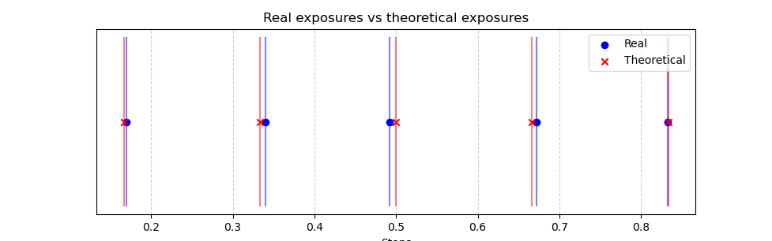

# striptest
A tool to quickly find optimal tempo settings for f/stop printing with a physical metronome in the darkroom.
## Overview
**striptest** is a Python script designed for darkroom enthusiasts who want to optimize their exposure settings for f/stop printing using a metronome, and specifically for making teststrips. This tool finds the best tempo settings and counting instructions, reducing exposure inaccuracies.

## Quickstart
Ensure you have python and numpy installed, download the file `striptest.py`, open a terminal, navigate to where the file is located and run
```
python striptest.py
```
By default it outputs a 7-step list in 1/3 stop increments with the base of 10 seconds in the middle. The optimal metronome tempo for timing these exposures happens to be 181 bpm. You will thus see the following output:
```
TEMPO 181
Count every 3rd beat

     Count      Stops    Seconds   Target Sec   % of stepsize Error
     5             -1      4.972        5.000      -2.4%
     6+1/3       -2/3      6.298        6.300      -0.1%
     8           -1/3      7.956        7.937       1.0%
    10              0      9.945       10.000      -2.4%
    12+2/3       +1/3     12.597       12.599      -0.1%
    16           +2/3     15.912       15.874       1.0%
    20             +1     19.890       20.000      -2.4%
```
Doing these exposures simply amounts to setting your metronome to the tempo (181), optionally making the metronome mark every third beat, and start counting (from 0) when you start your exposure. Keep counting on every third beat and make adjustments according to whatever teststrip method you use, as per the "Count" column.

As shown, we expose the entire strip for 5 counts (15 beats), then we cover the first piece and expose the rest for an additional 1+1/3 counts (4 beats) and so on.
## Background

### Traditional f/stop Printing
When working in the darkroom, exposures are best timed in f/stops, and these exposures are often timed using very expensive special f/stop timers. However, using a metronome set to 60 bpm (simply counting seconds) is also possible. Exposure calculations are done using $t = b \cdot 2^{\text{stop}}$

Where $t$ is the exposure time we are looking for, $b$ is a base time that we are calculating from, and **stop** is how many f/stops we want to adjust away from our base time.

However, this method has its drawbacks. Even when rounding exposure times to the nearest half-second, it can lead to inaccuracies. For example, if performing a 5-step test strip in 1/3-stop increments based on a 6-second base exposure:

| **Stops** | -2/3   | -1/3   | 0   |   +1/3|    +2/3   |
|-------:|--------|----------|----------|---------|-------------|
| **Formula** | $6\cdot2^{-2/3}$   | $6\cdot2^{-1/3}$   | $6\cdot2^{0}$   | $6\cdot2^{+1/3}$| $6\cdot2^{+2/3}$|
| **True time** (s)| 3.780   | 4.762  | 6   | 7.560 | 9.524| 
| **Rounded time** (s)| 4  | 5   | 6   | 7.5| 9.5 |
|**% of 1/3 stop error**| 24.5%| 21.1%|0%|3.4%| 1.1%|

As shown, half seconds are in some cases not granular enough. 

Furthermore, simply rounding seconds is in theory not always appropriate. It is theoretically possible for the rounding operation, to lead to a value that is further away from the desired exposure that if the rounding was done in the other direction. This is due to the logarithmic nature of f-stops, and the fact, that rounding should be done in logarithmic space (stop-space). 

Since we have a metronome at hand, there are many other timing options than 60 or 120 beats per second. As a matter of fact, for almost any realistic teststrip, it is possible to find a tempo that aligns well with the desired exposures, which opens up the possibility of very accurate f-stop exposures when doing our teststrips. 

This is what motivated the creation of this script.

## Function

### Basic Example
As shown in the **quickstart** section, the script can be run without any arguments.

However, to find the optimal tempo for a 6-second base exposure over 5 steps, we use the -b (base) and -n (numsteps) arguments:
```bash
$ python striptest.py -b 6 -n 5
TEMPO 190
Count every 3rd beat

     Count      Stops    Seconds   Target Sec   % of stepsize Error
     4           -2/3      3.789        3.780       1.1%
     5           -1/3      4.737        4.762      -2.3%
     6+1/3          0      6.000        6.000       0.0%
     8           +1/3      7.579        7.560       1.1%
    10           +2/3      9.474        9.524      -2.3%
```
As seen, the script finds an optimal tempo (e.g., 190 bpm) to minimize exposure inaccuracies, with much smaller errors compared to the above example counting half seconds.

In this case, set your metronome to 190 bpm, optionally make the metronome accent every third beat, and simply start exposing by counting the accented beats. The metronome will in this case be effectively beating triplets, so a count of 6+1/3 illustrates you should stop on the first triplet after the 6th accented beat.

As always in darkroom printing, you should start your exposure at the count of zero.

## Usage

To use the script, you can adjust several parameters to control how the tempo is calculated. Below are the options available:

- `-b`, `--base`: Base exposure time in seconds (float). Default is `10`.
- `-s`, `--stepsize`: Inverse of the stepsize as an integer (int). `1` is one stop, `2` is 1/2 stop, etc. Default is `3`.
- `-n`, `--numsteps`: Number of steps (int) for the strip test. Default is `7`.
- `-p`, `--baseplace`: The position of the base value in the test strip (1-indexed). The default is the middle for an uneven `n`, and left to middle for an even `n`.
- `-tmin`, `--tmin`: Minimum tempo (int) in bpm to consider. Default is `40`.
- `-tmax`, `--tmax`: Maximum tempo (int) in bpm to consider. Default is `208`.
- `-f`, `--file`: Optional input file with specific tempo options (plaintext file).
  Each line can either be:
    - A single BPM number (e.g., `60`).
    - A range of BPMs using the shorthand format `start:end [step]` (e.g., `40:60 [2]` for a range from 40 to 60 in steps of 2).
      Multiple ranges can be listed on separate lines. 
  If a file is provided, it overrides `-tmax` and `-tmin`.
- `-c`, `--cumulative`: Use cumulative timing for the test strip such that each step builds upon the previous. Useful for those who prefer to start counting from 0 on each step. Default is local timing where each step shows the time for its full exposure.
- `-d`, `--divisions`: Force a specific subdivision pattern for beats. Accepts an integer that sets the divisor (e.g., `2` for halves, `3` for triplets). Overrides the automatic subdivision based on tempo.

### More examples

To run a strip test with a base exposure of 6 seconds, 5 steps, and default options:
```bash
python striptest.py -b 6 -n 5
```

To specify a different stepsize (e.g., 1/2 stop increments):
```bash
python striptest.py -s 2
```

To use a custom tempo range between 60 and 180 bpm, and specify that we want to count every beat:
```bash
python striptest.py -tmin 60 -tmax 180 -d 1
```

To use a custom file with tempo options:
```bash
python striptest.py -b 6 -n 5 -f tempos.txt
```

Custom tempo files are useful for metronomes with skips in their possible bpm options. Some metronomes, for instance, only include every other bpm above a certain value, and even every third bpm above a higher value. Tempo files should contain tempo values in either of the following formats:

- **Single BPMs**: Each line should contain a single integer value representing a BPM.
  If you only want to use tempos 60, 120, and 180, the file contents should look like:
  ```
  60
  120
  180
  ```

- **Shorthand Ranges**: You can also specify ranges of tempos using the shorthand format:
  ```
  start:end [step]
  ```
  where `start` is the starting BPM, `end` is the ending BPM, and `step` is the interval. This makes it easy to specify a large range of tempos concisely.

  **Example**: 
  ```
  # This is a very common set of BPMs, used in many metronomes
  40:60 [2]
  60:72 [3]
  72:120 [4]
  120:144 [6]
  144:208 [8]
  ```

Multiple ranges and single BPMs can be mixed within the same file. Each tempo or range should be on its own line. If a tempo file is provided, it will override the `-tmax` and `-tmin` options specified on the command line.


### Extended example
Let's say our metronome has a range from 30-200 bpm, and that we previously obtained a good exposure at 8 seconds, but the contrast needed modification such that we know that the 8-second exposure might be slightly underexposed at the new contrast setting. We can do the following:
We make a 5-step teststrip where we place the base of 8 seconds at the first step, and do increments of 1/6 stops from there. Furthermore, we are doing a cumulative teststrip, so each step builds upon the next. For cumulative counting, it is often easier to set the divisions to 1, so we count every beat. This will result in the following output:
```
$ python striptest.py -b 8 -n 5 -p 1 -s 6 -tmin 30 -tmax 200 -c -d 1

TEMPO 180
Count every beat

     Count      Stops    Seconds   Target Sec   % of stepsize Error
    24              0      8.000        8.000       0.0%
     3           +1/6      9.000        8.980       2.0%
     3           +2/6     10.000       10.079      -6.8%
     4           +3/6     11.333       11.314       1.5%
     4           +4/6     12.667       12.699      -2.2%
```
While -6.8% error might seem like a lot, remember it is percentages of the stepsize, so it is not so bad. Here are these exposures plotted against the theoretical stops:

## Installation

1. Clone the repository:
   ```bash
   git clone https://github.com/BinFlush/striptest.git
   ```

2. Install dependencies (numpy):
   ```bash
   pip install numpy
   ```

## Contributing
Contributions are welcome! Please open an issue or submit a pull request.

# FAQ
* **How am I supposed to use the computer in a darkroom?**

Most people take some sort of notes when working in the darkroom. Many use an analog notebook, some use an ipad. Whatever your notetaking equipment may be, the data from this script can be easily transferred to the notes by hand. The intended use is, for this only to be used on a laptop in ligths-on scenarios, while planning your next step. When lights go out, the laptop should hibernate, or at least by some means expel no light. As long as the data is transferred to your processing notes.

If the "Count" numbers are difficult to memorize, they may be written on a scrap piece of paper, which can be referred to during exposure.

* **Why not build an arduino based f-stop timer since it's cheap?**

An arduino based f-stop timer is still not cheaper than a metronome, and the metronome is wonderfully flexible and simple. It can be seen as an example of the KISS design principle (Keep It Simple Stupid), where a basic wristwatch in principle could replace the metronome. This script then functions as a bridge between the metronomes full timing capabilities, and our f-stop printing.

Also, not everyone likes to solder, but everyone loves metronomes. 

* **Why doesn't this script just include a metronome?**

If the python script was responsible for timing during exposure, that would be a whole other piece of software. You could imagine a timer that simply beeps at the appropriate stops (with some count-in before each beep), but that would completely negate the necessity for a metronome, be-it hardware or software. Instead, you would simply end up with an ordinary software f-stop timer, which is a much simpler task than the optimization task this **striptest.py** solves. 

Software of this sorts would also need some way to reliably turn off any lights (screen, backlight keyboard, power switch, etc...) during exposure, which is a nontrivial task. Arduino-kits or commercial f-stop timers are better suited for this.

* **Is this precision necessary**

In short - not really. I have always done f-stop printing with the method as described in the **Background** section above, simply counting naively rounded half seconds. This is accurate enough as long as you keep the exposures long enough, typically above 10 or 12 seconds..

This software is mostly for those who get satisfaction from using the simple tools at hand in an optimal manner. It is fun to get precise arbitrary exposure intervals from a simple metronome. I don't expect many people to use it, but I definately do.


# Not-so-FAQ
* **How does the math work?**

That is a great question. I'm glad you asked!

We are looking for the optimal bpm tempo $t \in T \subset \mathbb{N}$ for which there exist beat numbers $\mathbf{M}^* \subset \mathbb{N}^n$ such that these beats best match a set of target exposure stops $\mathbf{a}=[a_k]_{k=1}^n$ which describe the deviance from a basetime $b$. 

For a given stop $a_k$, we have the required time (in seconds) for that exposure:

```math
s = b \cdot 2^{a_k}
```
Since a given beat placement is just a function of the beat number and the tempo: 
```math
s = m \cdot \frac{60}{t}
```
we have:
```math
m \cdot \frac{60}{t} = b \cdot 2^{a_k} \implies m \cdot \frac{60}{t \cdot b} = 2^{a_k} \implies \log_2(m) + \log_2\left(\frac{60}{t \cdot b}\right) = a_k
```

However, since we need integer values of $m$, what we actually want is to minimize the expression:
```math
 \mathcal{L}_t = \sum_{k=1}^n \epsilon_k = \sum_{k=1}^n \left(\log_2(m^*_k) + \log_2\left(\frac{60}{t \cdot b}\right) - a_k\right)^2,  \quad m^* \in \mathbb{N}
```

Let $u$ be a function of the tempo $t$:
```math
u(t) = \log_2\left(\frac{60}{t \cdot b}\right)
```
Then, we can rewrite $\mathcal{L}$ as:
```math
\mathcal{L}_t = \sum_{k=1}^n \epsilon_k = \sum_{k=1}^n \left(\log_2(m^*_k) + u(t) - a_k\right)^2, \quad m^* \in \mathbb{N}
```

If we look at a single $k$, we have:
```math
\epsilon_k = \left(\log_2(m^*_k) + u(t) - a_k\right)^2
```
but we can insert $m$ into this and get:
```math
\left(\log_2(m_k) + u(t) - a_k\right)^2 = 0 \implies \log_2(m_k) = a_k - u(t) \implies m_k = 2^{a_k - u(t)}
```

This is great. We now have $m_k$, but remember it is in $\mathbb{R}$, and we cannot simply round it, since this operation would be done in linear space. We have to find the closest $m^*$ in log-space.

### Finding the Closest Integer in Log-Space

To find the closest integer beat number $m_k^*$ in log-space, we need to find the integers that minimize the error in the logarithmic domain. Since $m_k = 2^{a_k - u}$ is a real number, we denote its closest integers as $m_k^{\text{low}}=\lfloor m_k \rfloor$ and $m_k^{\text{high}} = \lceil m_k \rceil$.

We now need to choose between these two candidates based on which one minimizes the error in log-space:
```math
\epsilon_k = \left(\log_2(m_k^*) + u - a_k\right)^2
```

We compute the errors for both rounding options:
- For $m_k^{\text{low}}$, the error is:
```math
  \epsilon_k^{\text{low}} = \left(\log_2(m_k^{\text{low}}) + u - a_k\right)^2
```
- For $m_k^{\text{high}}$, the error is:
```math 
  \epsilon_k^{\text{high}} = \left(\log_2(m_k^{\text{high}}) + u - a_k\right)^2
```

We then select $\hat{m}_k^*$ as the value that minimizes the error:
```math
\hat{m}_k^* = 
\begin{cases} 
m_k^{\text{low}} & \text{if } \epsilon_k^{\text{low}} \leq \epsilon_k^{\text{high}} \\
m_k^{\text{high}} & \text{otherwise}
\end{cases}
```

### Calculating the Total Error
Once we find the optimal $\hat{m}_k^*$ for each $k$ given a tempo $t$, we can calculate the total error:
```math
\mathcal{L}_t=\sum_{k=1}^n\epsilon_k = \left(\log_2(\hat{m}_k^*) + u(t) - a_k\right)^2
```


### Optimizing Over Tempi
To find the optimal tempo $t$, we iterate over all possible tempi $t \in T$, and for each tempo, compute the corresponding $\hat{m}_k^*$ values and evaluate the total error $\mathcal{L}_t$. The optimal tempo $t^*$ is the one that yields the smallest error:
```math
t^* = \arg\min_{t \in T} \mathcal{L}_t
```

### Further optimizations
Any given tempo $t$, has beats $B_t = \{1\cdot \frac{60}{t},2\cdot \frac{60}{t},...\}$.
If we then consider another tempo $t'=t/n, \quad n \in \mathbb{N}$ with beats 
```math
B_{t'}= \left\{1\cdot \frac{60}{t'},2\cdot \frac{60}{t'},...\right\} = \left\{1n\cdot \frac{60}{t},2n\cdot \frac{60}{t},...\right\}
```
We can immediately see that $B_t' \subset B$.
When evaluating through the set of tempi, we therefore start from the maximum bpm and work downwards. Whenever we encounter a tempo that is guaranteed not to be the optimal (because its loss $\mathcal{L}_t$ is not the lowest so far), we thus know that all other tempi $t'$ that divide $t$ also cannot have an optimal solution. We therefore skip evaluating these tempi further down the line. We do this by simply finding all divisors of $t$ and adding them to an "exclude" set.


