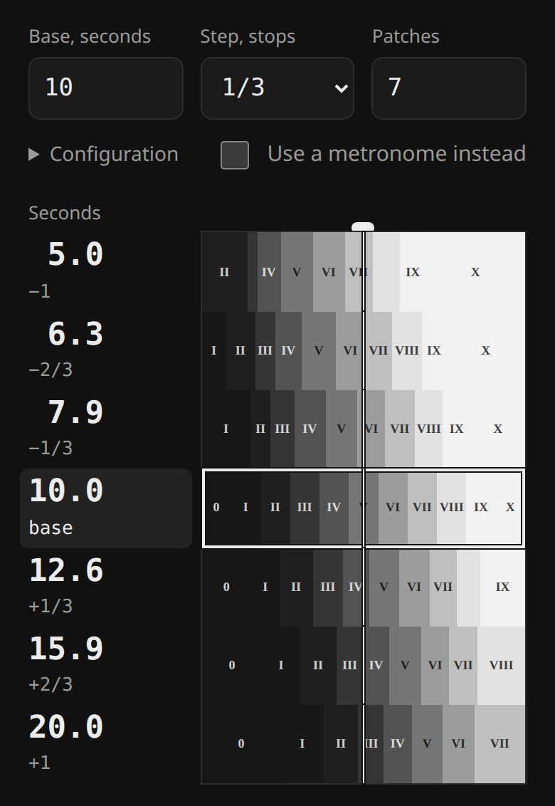
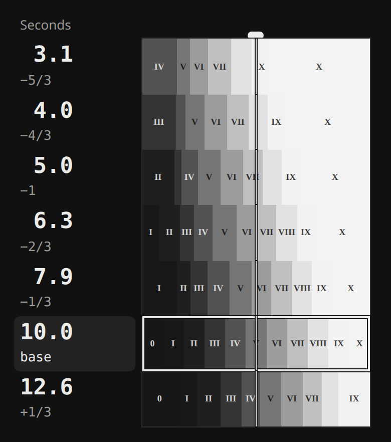
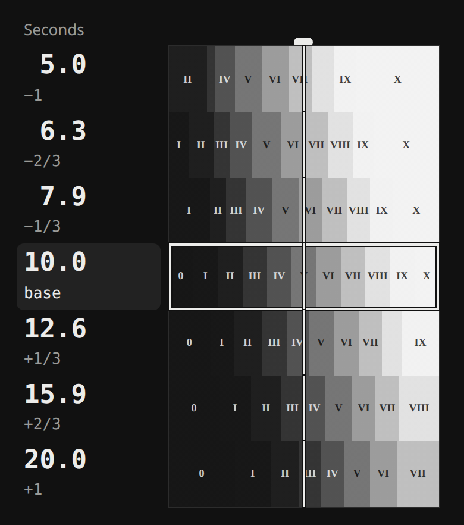
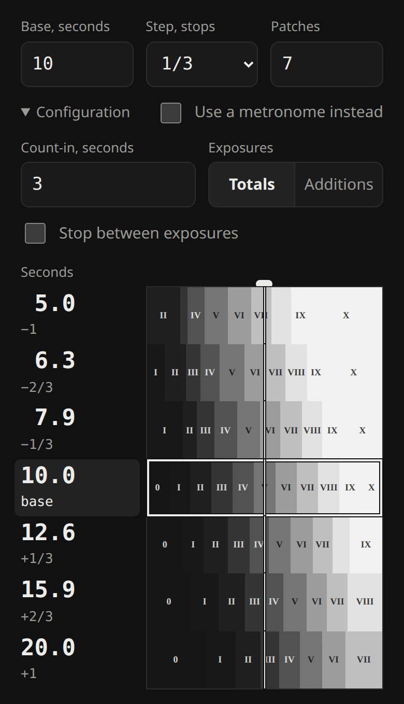
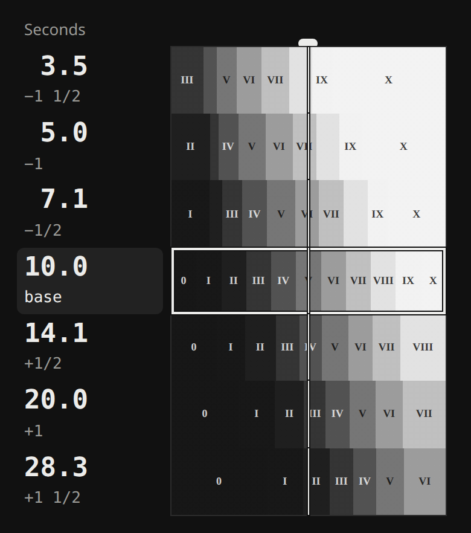
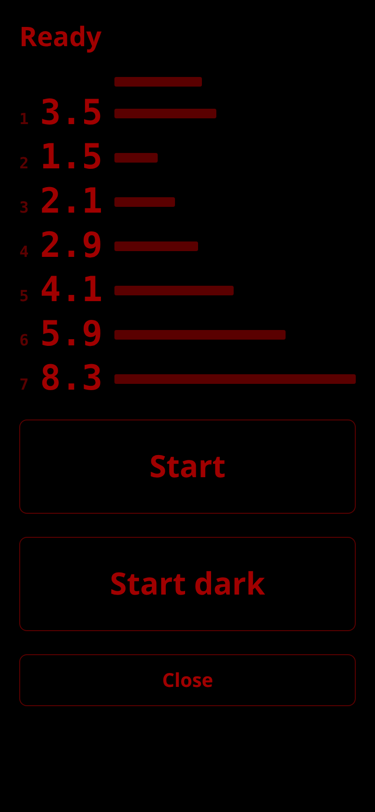
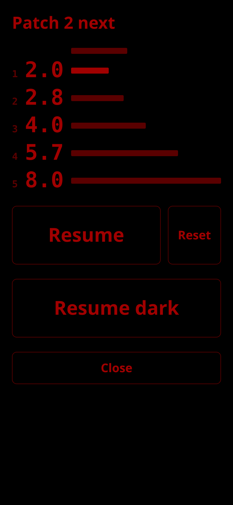
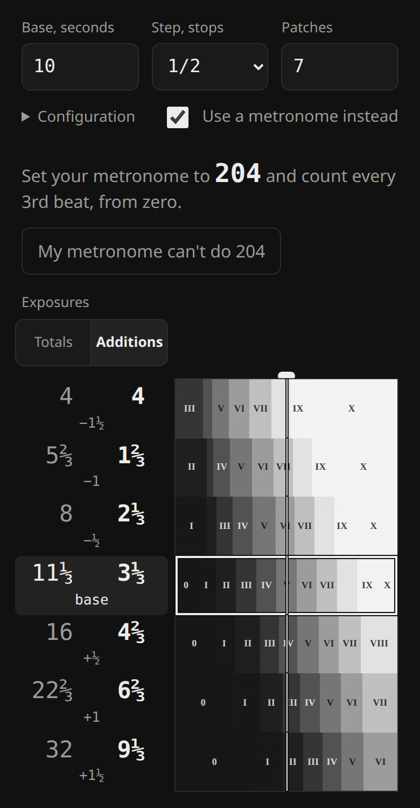
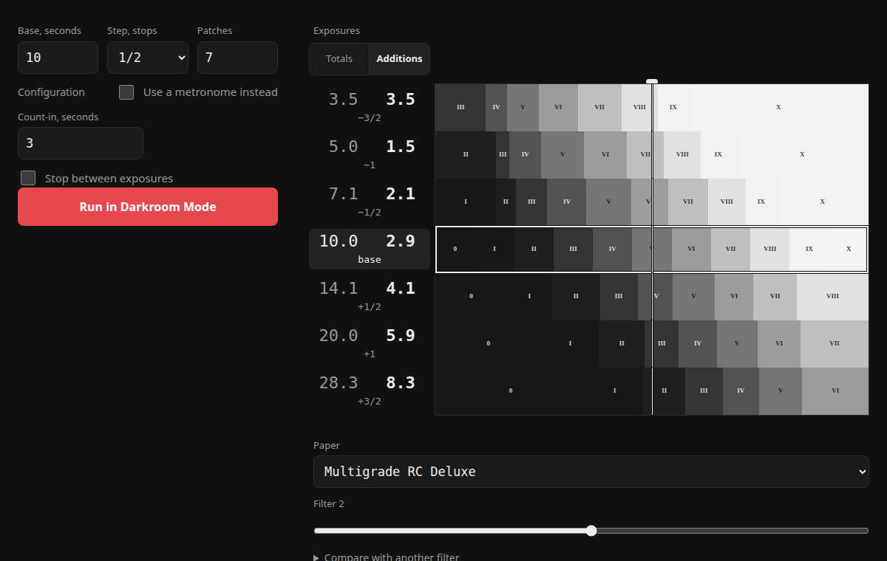

# striptest
A tool for planning f/stop test strips in the darkroom, and for timing them: by sound cues the page makes itself, or with a physical metronome at the best tempo for the strip. The seconds are there too, for anyone with a timer.

**Use it here: https://binflush.github.io/striptest/**

## Overview
**striptest** is for darkroom printers who f/stop print. It has two parts.

1. A plan for the test strip, with two ways of timing it, neither of which I have seen elsewhere.
2. A map of tones under the plan: roughly what every patch is going to do to the picture, on the paper and filter chosen, so that a test strip can be planned before it is exposed and read after.

### Timing
1. **Sound cues.** The page counts you in and then sounds every moment you have to act on, so there is nothing to read in the dark. A steady tone holds while the lamp is on, and another sweeps up an octave, from 440 Hz to 880 Hz, into each moment; when it lands, that is the moment to cover the next patch, or to move the strip along. It can also stop between the patches, for you to move the card.
2. **Metronome.** Timing with a metronome is not a new idea. There is an established tradition of darkroom printing with one, but it has traditionally been set to measure whole or fractional seconds. This tool expands on that by solving an optimisation problem: for a given set of exposures, what tempo gives the best alignment with them. It is a surprisingly accurate and usable way to time a print, and the page can run the metronome for you too.
3. **Your own timer.** The plan gives the seconds for every patch, to a tenth, which is about what a timer can be set to.

### The map
Every patch has a strip of tones beside its figure. Each strip shows what that patch prints as, in the zones of the Zone System, and the strips abut, so a tone in the picture can be followed straight up and down the map from patch to patch. Each paper has its own curves, and the filter changes how far apart the patches land, so both are chosen under the map. A second filter can be laid under the first, to see whether a change of contrast would do what more exposure would not. This is for the age-old question, *"should I change the exposure, or is it the contrast?"*

## Quickstart
Open https://binflush.github.io/striptest/, type in your base time, and pick the step size and the number of patches. The map gives the seconds for every patch: what each adds to the one before, the way a strip is covered. Press **Run in Darkroom Mode** at the foot of the screen, then **Start**, and the page counts you in and sounds each patch. Tick **Use a metronome instead** and it gives you a tempo and the counts instead. The section **The website** below goes through the rest.

## The website
The website lives at https://binflush.github.io/striptest/. It does the same job as the Python script this started as, and a good deal more, and it does it in your browser, so it also works on the phone in your pocket. Everything is calculated on your own device, and nothing is sent anywhere.

The easiest way to explain it is to go through a printing session.

### The plan
Let's say we have a fresh negative in the enlarger and our best guess is that it needs somewhere around 10 seconds. We want a test strip of 7 patches in 1/2 stop steps around that guess. So we type 10 into **Base, seconds**, choose 1/2 under **Step, stops** and 7 under **Patches**. These happen to be the defaults, so in this case we just open the page:

<p align="center"> </p>

The map has one row for each patch. On the left, large, are the seconds each patch adds to the one before — 3.5 for the first, then 1.5, 2.1, 2.9 and so on — the way a strip is exposed with a card: give the whole strip 3.5 seconds, cover the first patch, give the rest 1.5 more, cover the next, and so on. Under them is where the patch sits in stops, from a stop and a half below the base to a stop and a half above. The base is the patch we believe in, marked with a tile round its figure and a box round its strip. It starts on the middle patch, so the others bracket it; tapping any patch, its figure or its strip, makes that one the base instead, and the others are drawn against it. On the first patch the strip only goes up from there.

Those who expose every patch on its own instead, in a holder with a window, choose **Totals** under **Exposures** in Configuration, and each figure becomes what the patch has had in all: 3.5, 5.0, 7.1, 10.0 and so on up to 28.3, with the heading over them saying Seconds. That is also how a strip is read afterwards: the patch that looks right is printed at its total. With a timer, either figure is all there is to it. The choice is also what a run in the darkroom gives each patch; more on that below.

### Reading the map
The strips are a rough simulation of what the patches are going to look like, in the zones of the Zone System: 0 is full black, V is middle grey and X is paper white. The base patch's strip is simply the scale from 0 to X, and every other strip is that same scale after the patch's exposure. A place across the map is one part of the picture. So we pick a tone in the base row, say a highlight in Zone VIII, and look straight up and down: the zone we find at that same place in another row is what that highlight prints as in that patch. Here it is a IX one patch lighter and paper white beyond that; one patch darker it is a VII, then a VI, and a V on the last patch.

The zones are coarse, and a lot can happen inside one. For the nuances, slide a finger sideways along any strip, or drag with the mouse. The map then stops showing the scale, and every strip shows one single tone in full: the tone that the part of the picture under the finger gets in that patch, with the zone it is nearest to. The pin stays where the finger leaves it, and sliding picks nothing.

<p align="center"> </p>

How much happens from one patch to the next depends on the paper, chosen under **Paper** below the map, and a lot on the filter, set with the **Filter** slider under it. Here is the same strip at filter 00 and at filter 5:

<p align="center"> </p>

At filter 00 it takes about a stop to move a tone by one zone, so neighbouring patches half a stop apart often land in the same zone, and I would go for bigger steps. At filter 5 half a stop is about two zones, neighbouring patches look nothing alike, and finer steps are needed to land anywhere near the right exposure.

How seriously should the strips be taken? Not very. The tones come from the characteristic curves in Ilford's data sheets for the papers offered — the current Multigrade RC Deluxe, the cotton-rag Multigrade Art 300, the fibre-based Multigrade FB Classic, and the Multigrade IV RC Deluxe that the first of them replaced — developed the way Ilford developed them. Art 300 is the odd one: being matte, its blackest black is 1.4 against a glossy paper's 2.08, and the strips show that, with the dark zones far closer together. Only Zone V is a fixed tone, 18% grey. Zone 0 and Zone X are simply the blackest and the whitest the paper gets, and the zones in between are placed where a normally developed negative would put them at filter 2 on Multigrade IV. Your paper, your developer and above all your negative are different. The strips are there to build intuition; they do not replace the actual test strip.

### Reading the test strip
The strip is developed and dry, and the fourth patch, the base's 10 seconds, looks about right, but the shadows do not: the darkest part of the picture that should still show some detail, which we would like to see in Zone II, has only made it to a III. More exposure would darken it, but as we just saw, that drags the highlights down with it. This is a job for a harder filter, and we can try one on the page before we expose for it. Under the filter slider we open **Compare with another filter** and set it to 3:

<p align="center"> </p>

Every row now has a second strip under its first. It is the same patch, exposed for the same seconds, but through filter 3. The strips are read exactly as before, and a place across them is still one part of the picture. So we find our shadow in the base row's upper strip and look at the strip right under it: the III becomes a II, which is what we wanted. And the highlights? The same slide over the Zone VIII highlight shows filter 3 lifting it to a IX at 10 seconds, and an VIII again half a stop up, at 14.1. So filter 3 it is, and the exposure lies somewhere between 10 and 14.1 seconds. That is what the next strip is for: 12 as the base, 1/6 stop steps, 5 patches, and the filter slider up to 3 — or, to start the strip at the base and only go up from there, the first patch tapped as the base.

The two filters are lined up by the paper speeds in Ilford's data sheets. Multigrade filters are speed matched: 00 to 3 need the same exposure, and 4 and 5 need more — a whole stop on Multigrade IV and on Art 300, about an eighth of one on FB Classic and the current RC Deluxe, if the sheets are to be believed. With other filters, a colour head, or filters that have faded over the years this is going to be off, so the same goes as before: the strips are there to build intuition.

### Configuration
Under the fields, **Configuration** holds what belongs to the way of timing chosen. For sound cues that is the **count-in**, the seconds the page waits before the lamp goes on: three is the least, because it counts three in, and a longer one simply waits before counting them — make it as long as you need to get a hand to the switch. **Exposures** is the choice above between additions and totals: it says what the map shows and what a run gives each patch. **Stop between exposures** is described in the next section. On a wide screen Configuration stands open, in a rail beside the map.

<p align="center"> </p>

### At the enlarger
Everything so far happens with the lights on. When they go out the phone is the wrong shape entirely: a white page is a fog risk, the browser's bars are in the way, and the screen turns itself off halfway through a strip. The button at the foot of the screen, **Run in Darkroom Mode**, deals with all three. It fills the screen with the plan in large red type on black, asks the phone to stay awake, and shows nothing that can be set. **Close**, or Escape, brings the page back.

<p align="center"> </p>

The plan in the view is the map's figures with a bar beside each, as long as that patch's exposure, with one more above them all for the count-in, all to one scale, so that before anything is started the plan is already a picture of how long the strip takes. **Start** runs it, and a run gives every patch exactly the figure beside it, in turn. With **Additions** that is what each patch adds, for a strip covered as it goes: 3.5 seconds, then 1.5, then 2.1, the lamp staying on and the next patch covered at each mark. With **Totals** it is each patch's whole exposure, one after the other, for a strip moved along in a holder at each mark: 3.5, then 5.0, then 7.1. The count-in counts three soft beats, one a second, the last of them a second before the lamp. On the lamp a drone comes in and holds for as long as the exposure runs. Over it a tone climbs, and lands an octave higher exactly on each moment you have to act on, where a short beat falls, louder and an octave above the ones that counted you in: one for each patch, and the last is the lamp off. Then silence, which is how you know it is over. Because the pitch is always climbing towards the next one, a moment never arrives unannounced, and it arrives just as decisively whether the gap was one second or ten. As the run goes, the bar of the wait it is on fills, meeting its end as the beat is heard, and the line about the run and the Stop button fall back, so that the figures stay the brightest thing on the screen.

**Start dark** gives the screen up altogether: by ear you need not look at all, and a screen is only a light source. It stays black after the run has finished as well, which is deliberate — a strip ending is the worst possible moment to light the room, with the paper still out. The whole of that black screen is then the one control. A tap starts a run and stops one that is going, and a hold of about three quarters of a second gives the screen back and ends the run with it; it reddens very faintly while you hold, so you can tell the hold has taken. Started the lit way, a press on the button stops the run at once. If the phone rings, or anything else takes the page away mid-run, the sound stops and the view says so: that strip is spoiled, and better to know it.

With **Stop between exposures** ticked, the page runs one patch at a time. Each patch is announced first — one short blip for the first, two for the second — then counted in and given its figure, and the lamp goes off. The view then waits, *Patch 2 next*, and **Resume**, or a tap on the black screen, runs the next. **Reset** goes back to the first patch. A patch stopped part way starts again from its blips, and the bars keep the score: the patches done stay full.

Red only is safer than white, but it is not safe, and the page says so too. The screen is still a light source, and Multigrade paper is most sensitive to exactly the green and blue that a red-only screen leaves out — which is the point, but a bright phone held over the paper will still fog it. Turn the brightness right down, keep the phone away from the easel, and test your own phone before trusting it: leave a scrap of paper face up beside it for five minutes and develop that. Turn on airplane mode or Do Not Disturb first, because a notification lights the whole screen at full brightness, and that is a fogged sheet.

### With a metronome
Tick **Use a metronome instead**, and the page says what to set the metronome to and what to count:

<p align="center"> </p>

We set the metronome to 204 and count every 3rd beat. The figures are now counts, and each patch is counted from zero: we start the exposure on the count of zero, cover the first patch on the count of 4, start again from zero and cover the next on 1+2/3, then on 2+1/3, on 3+1/3 and so on. A count of 1+2/3 means the second beat after the first counted one. Every patch is a whole number of beats, so a count always starts on a counted beat, though it may end on one between. The counts are chosen to land as close to the f/stop times as a tempo allows — here no patch is more than 0.5% of half a stop off, which is quite a bit better than counting half seconds gave us in the **Background** section — and when a patch is more than a tenth of a step off, the page says so in red beside its stops.

Most metronomes can't do 204. Many have gaps between their tempos, especially the fast ones. So we press **My metronome can't do 204**, and get the next best tempo instead: 203, which a digital metronome has. My old mechanical one has neither, nor the 169, 205 and 119 that come after, but the fifth press lands on 168, which is on its dial, counting every 2nd beat: 5, then 2, 3, 4 and so on, none of them more than 2.9% of a step off. The tempos we have skipped are remembered on the device, so after a few sessions the page knows the metronome and goes straight to what it has. A tempo skipped by mistake is brought back by pressing it in the **Skipping** list, and **Forget all skipped tempos** under Configuration starts over. Configuration also holds the metronome's range, **Slowest** and **Fastest**, and **Count every**, which is normally chosen for you so that the counting pace stays near one a second. Choose **Totals** under **Exposures** and one count runs on from the start of the strip instead: 4, 5+2/3, 8, 11+1/3 and so on.

The page can run the metronome too. Press **Run in Darkroom Mode**, then **Start**, and it keeps that tempo for as long as you let it, striking the beat you count an octave above the rest. **Start dark** does the same with the screen black. It is a plain metronome, nothing more: the counting is still yours, and a hardware one does just as well.

### On a phone, on a desk
Before a printing session, add the page to the home screen — from Share → Add to Home Screen on an iPhone, or the browser menu on Android. It then opens without the browser's bars, which on an iPhone is the only way to be rid of them in the darkroom view, and it works with no network at all once it has been opened online once.

On a wide screen the settings go into a rail on the left with the run button under them, and the map takes the rest:

<p align="center"></p>

## Background

### Traditional f/stop Printing
When working in the darkroom, exposures are best timed in f/stops, and these exposures are often timed using very expensive special f/stop timers. However, using a metronome set to 60 bpm (simply counting seconds) is also possible. Exposure calculations are done using $t = b \cdot 2^{\text{stop}}$

Where $t$ is the exposure time we are looking for, $b$ is a base time that we are calculating from, and **stop** is how many f/stops we want to adjust away from our base time.

However, this method has its drawbacks. Even when rounding exposure times to the nearest half-second, it can lead to inaccuracies. For example, if performing a 5-step test strip in 1/3-stop increments based on a 6-second base exposure:

| **Stops** | -2/3   | -1/3   | 0   |   +1/3|    +2/3   |
|-------:|--------|----------|----------|---------|-------------|
| **Formula** | $6\cdot2^{-2/3}$   | $6\cdot2^{-1/3}$   | $6\cdot2^{0}$   | $6\cdot2^{+1/3}$| $6\cdot2^{+2/3}$|
| **True time** (s)| 3.780   | 4.762  | 6   | 7.560 | 9.524| 
| **Rounded time** (s)| 4  | 5   | 6   | 7.5| 9.5 |
|**% of 1/3 stop error**| 24.5%| 21.1%|0%|3.4%| 1.1%|

As shown, half seconds are in some cases not granular enough. 

Furthermore, simply rounding seconds is in theory not always appropriate. It is theoretically possible for the rounding operation, to lead to a value that is further away from the desired exposure that if the rounding was done in the other direction. This is due to the logarithmic nature of f-stops, and the fact, that rounding should be done in logarithmic space (stop-space). 

Since we have a metronome at hand, there are many other timing options than 60 or 120 beats per second. As a matter of fact, for almost any realistic teststrip, it is possible to find a tempo that aligns well with the desired exposures, which opens up the possibility of very accurate f-stop exposures when doing our teststrips. 

This is what motivated the creation of this script.

## The Python script
This started as a Python script, written for my own use and run on a laptop while planning a printing session. It is still here, and it is still the reference: the website is tested against it on thousands of random settings, so the two always agree on the tempo and the counts. It finds the tempo and the counts for a metronome, and nothing else.

Ensure you have python and numpy installed, download `striptest.py`, and run it:
```
python striptest.py
```
By default it plans 7 patches in 1/2 stop steps around a base of 10 seconds, for which the best tempo happens to be 204 bpm:
```
TEMPO 204
Count every 3rd beat

     Count      Stops    Seconds   Target Sec   % of stepsize Error
     4           -3/2      3.529        3.536      -0.5%
     5+2/3         -1      5.000        5.000       0.0%
     8           -1/2      7.059        7.071      -0.5%
    11+1/3          0     10.000       10.000       0.0%
    16           +1/2     14.118       14.142      -0.5%
    22+2/3         +1     20.000       20.000       0.0%
    32           +3/2     28.235       28.284      -0.5%
```
Set the metronome to 204, let it accent every third beat if it can, and start counting from zero as the exposure starts: the whole strip gets 4 counts (12 beats), then the first patch is covered and the rest get up to 5+2/3, and so on. The script keeps one count running unless `-c` is given, which starts the count again at every patch, as the page does by default.

### Usage
- `-b`, `--base`: Base exposure time in seconds (float). Default is `10`.
- `-s`, `--stepsize`: Inverse of the step size as an integer (int). `1` is one stop, `2` is 1/2 stop, etc. Default is `2`.
- `-n`, `--numsteps`: Number of steps (int). Default is `7`.
- `-p`, `--baseplace`: Where the base is placed, in steps from the first patch. `-p 0` puts the base on the first patch, `-p -1` one step before the strip. By default the base is placed in the middle for an uneven number of steps, and just before the middle for an even one.
- `-tmin`, `--tmin`: Slowest tempo (int) in bpm to consider. Default is `40`.
- `-tmax`, `--tmax`: Fastest tempo (int) in bpm to consider. Default is `208`.
- `-f`, `--file`: A file of the tempos the metronome has, one per line, either a single bpm (`60`) or a range as `start:end [step]` (`40:60 [2]`). Lines starting with `#` are comments. A file overrides `-tmin` and `-tmax`. Metronomes with gaps between their tempos are what this is for; a common scale is `40:60 [2]`, `60:72 [3]`, `72:120 [4]`, `120:144 [6]`, `144:208 [8]`.
- `-c`, `--cumulative`: Count each patch from zero, so that every count is what the patch adds to the one before. By default each count is the patch's total.
- `-d`, `--divisions`: Count every so many beats (`1` for every beat, `3` for every third). By default this is chosen from the tempo.
- `--plot`: Plot the achieved stops against the target stops at the end.

For a 6-second base over 5 patches in thirds, `python striptest.py -b 6 -n 5 -s 3` finds 190 bpm, counting every 3rd beat: 4, 5, 6+1/3, 8 and 10. And a strip of 5 patches in 1/6 stop steps from an 8-second base placed one step before it, counted from zero on every beat on a metronome that runs from 30 to 200 — `python striptest.py -n 5 -b 8 -p -1 -s 6 -tmin 30 -tmax 200 -c -d 1 --plot` — comes to 160 bpm: 24 beats, then 3, 3, 4 and 4 more, none of them more than 4.9% of a step off, which the plot shows:


To run the tests as well, clone the repository and `pip install -r requirements.txt`.

## Contributing
Contributions are welcome. Please open an issue or submit a pull request.

There is a test suite, run with `just check` (it needs python with numpy, node and [just](https://github.com/casey/just)). It checks that the Python script still reproduces the examples in this README, and that the website agrees with the Python script on a few thousand random settings.

# FAQ
* **How am I supposed to use a screen in a darkroom?**

Most people take some sort of notes when working in the darkroom, and the plan can always go into them by hand. The website's darkroom mode is the other answer: red on black, large enough to read at the enlarger, or no screen at all with **Start dark**, since by ear there is nothing to read. Whatever you do, a phone screen is a very effective way of fogging paper, so it goes face down or out of the room before the paper comes out, unless you have tested it.

* **Why not build an Arduino based f-stop timer since it's cheap?**

An Arduino based f-stop timer is still not cheaper than a metronome, and the metronome is wonderfully flexible and simple. It can be seen as an example of the KISS design principle (Keep It Simple Stupid), where a basic wristwatch in principle could replace the metronome. This tool then functions as a bridge between the metronome's full timing capabilities and our f-stop printing.

Also, not everyone likes to solder, but everyone loves metronomes.

* **Why a metronome at all, when the page can time the strip?**

Because the tempo search is what this whole thing is about, and it is still the only way to get an arbitrary interval out of a real metronome, which remains my own way of working. The sound cues are a different answer to the same problem, for when there is neither a timer nor a metronome to hand: nothing to count, just the moments you have to act on, with the pitch climbing into each one. And if what you want is a proper f-stop timer, something like [GoTimer's enlarger timer](https://gotimer.org/photography/enlarger-timer) is a better fit than either.

* **Is this precision necessary?**

In short - not really. I have always done f-stop printing with the method described in the **Background** section above, simply counting naively rounded half seconds. This is accurate enough as long as you keep the exposures long enough, typically above 10 or 12 seconds.

This software is mostly for those who get satisfaction from using the simple tools at hand in an optimal manner. It is fun to get precise arbitrary exposure intervals from a simple metronome. I don't expect many people to use it, but I definitely do.

# Not-so-FAQ
* **How does the math work?**

That is a great question. I'm glad you asked!

We are looking for the optimal bpm tempo $t \in T \subset \mathbb{N}$ for which there exist beat numbers $\mathbf{M}^\ast \subset \mathbb{N}^n$ such that these beats best match a set of target exposure stops $\mathbf{a}=[a_k]_{k=1}^n$ which is a vector of required stopwise deviances from a basetime $b$. 

For a given stop $a_k$, and a base $b$, we have the required time (in seconds) for that exposure:

```math
s = b \cdot 2^{a_k}
```
Since a given beat placement is just a function of the beat number and the tempo: 
```math
s = m \cdot \frac{60}{t}
```
we have:
```math
m \cdot \frac{60}{t} = b \cdot 2^{a_k} \implies m \cdot \frac{60}{t \cdot b} = 2^{a_k} \implies \log_2(m) + \log_2\left(\frac{60}{t \cdot b}\right) = a_k
```

However, since we need integer values of $m$, what we actually want is to minimize the expression:
```math
 \mathcal{L}_t = \sum_{k=1}^n \epsilon_k = \sum_{k=1}^n \left(\log_2(m^\ast_k) + \log_2\left(\frac{60}{t \cdot b}\right) - a_k\right)^2,  \quad m^\ast \in \mathbb{N}
```

Let $u$ be a function of the tempo $t$:
```math
u(t) = \log_2\left(\frac{60}{t \cdot b}\right)
```
Then, we can rewrite $\mathcal{L}_t$ as:
```math
\mathcal{L}_t = \sum_{k=1}^n \epsilon_k = \sum_{k=1}^n \left(\log_2(m^\ast_k) + u(t) - a_k\right)^2, \quad m^\ast \in \mathbb{N}
```

If we look at a single $k$, set $\epsilon_k$ to zero, and we have:
```math
\epsilon_k = \left(\log_2(m^\ast_k) + u(t) - a_k\right)^2
```
but we can insert $m$ into this and get:
```math
\left(\log_2(m_k) + u(t) - a_k\right)^2 = 0 \implies \log_2(m_k) = a_k - u(t) \implies m_k = 2^{a_k - u(t)}
```

This is great. We now have $m_k$, but remember it is in $\mathbb{R}$, and we cannot simply round it, since this operation would be done in linear space. We have to find the closest $m_k^\ast$ in log-space.

### Finding the Closest Integer in Log-Space

To do this we need to find the integers that minimize the error in the logarithmic domain. Since $m_k = 2^{a_k - u}$ is a real number, we denote its closest integers as $m_k^{\text{low}}=\lfloor m_k \rfloor$ and $m_k^{\text{high}} = \lceil m_k \rceil$.

We now need to choose between these two candidates based on which one minimizes the error in log-space:
```math
\epsilon_k = \left(\log_2(m_k^\ast) + u - a_k\right)^2
```

We compute the errors for both rounding options:
- For $m_k^{\text{low}}$, the error is:
```math
  \epsilon_k^{\text{low}} = \left(\log_2(m_k^{\text{low}}) + u - a_k\right)^2
```
- For $m_k^{\text{high}}$, the error is:
```math 
  \epsilon_k^{\text{high}} = \left(\log_2(m_k^{\text{high}}) + u - a_k\right)^2
```

We then select $\hat{m}_k^\ast$ as the value that minimizes the error:
```math
\hat{m}_k^\ast = 
\begin{cases} 
m_k^{\text{low}} & \text{if } \epsilon_k^{\text{low}} \leq \epsilon_k^{\text{high}} \\
m_k^{\text{high}} & \text{otherwise}
\end{cases}
```

### Calculating the Total Error
Once we find the optimal $\hat{m}_k^\ast$ for each $k$ given a tempo $t$, we can calculate the total error:
```math
\mathcal{L}_t=\sum_{k=1}^n\epsilon_k = \left(\log_2(\hat{m}_k^\ast) + u(t) - a_k\right)^2
```


### Optimizing Over Tempi
To find the optimal tempo $t$, we iterate over all possible tempi $t \in T$, and for each tempo, compute the corresponding $\hat{m}_k^\ast$ values and evaluate the total error $\mathcal{L}_t$. The optimal tempo $t^\ast$ is the one that yields the smallest error:
```math
t^\ast = \arg\min_{t \in T} \mathcal{L}_t
```

### Further optimizations
Any given tempo $t$, has beats $B = \\{1\cdot \frac{60}{t},2\cdot \frac{60}{t},...\\}$.
If we then consider another tempo $t^{\prime}=t/n, \quad n \in \mathbb{N}$ with beats 
```math
B^\prime= \left\{1\cdot \frac{60}{t^\prime},2\cdot \frac{60}{t^\prime},...\right\} = \left\{1n\cdot \frac{60}{t},2n\cdot \frac{60}{t},...\right\}
```
We can immediately see that $B^\prime \subset B$.
When evaluating through the set of tempi, we therefore start from the maximum bpm and work downwards. Whenever we encounter a tempo that is guaranteed not to be the optimal (because its loss $\mathcal{L}_t$ is not the lowest so far), we thus know that all other tempi $t^\prime$ that divide $t$ also cannot have an optimal solution. We therefore skip evaluating these tempi further down the line. We do this by simply finding all divisors of $t$ and adding them to an "exclude" set.


