# striptest
A tool for planning f/stop teststrips in the darkroom, and for timing them: with an ordinary timer, with a physical metronome at the optimal tempo, or by the sound of the page itself.

**Use it right here: https://binflush.github.io/striptest/**
## Overview
**striptest** is a tool designed for darkroom enthusiasts who want to optimize their exposure settings for f/stop printing using a metronome, and specifically for making teststrips. This tool finds the best tempo settings and counting instructions, reducing exposure inaccuracies.

It started out as a Python script that I wrote for my own use, to be run on a laptop while planning a printing session. That works fine, but it is not very portable, and the computer I actually carry around is a phone. So the whole thing has been reimplemented as a website, which does the same calculation directly in your browser. There is nothing to install, it fits on a phone screen, and nothing you type is sent anywhere.

The Python script is still here and still works. It is in fact the reference: the website is tested against it on thousands of random settings, so the two always agree on the tempo and the counts. The website has also grown a few things the script never had. It plans the teststrip no matter how it is going to be timed: with an ordinary timer it simply gives the seconds for every patch, with a metronome it finds the tempo, and it can also do the timing itself, by sound, so that neither is needed. It has a darkroom view, which is red on black and large enough to read at the enlarger, an easy way to tell it which tempos your metronome lacks, and a simulated teststrip that shows roughly what the patches are going to do to the tones. Opened once while online it works in airplane mode after that, and it can be added to a phone's home screen like any other app. All of it is described below.

## Quickstart
### On the website
Open https://binflush.github.io/striptest/, type in your base time, and pick the stepsize and the number of steps. The table then gives the seconds for every patch, to be used with a timer. Choose **a metronome** under **Timed with**, and you get a big red number instead, which is the tempo for your metronome, and a table that tells you what to count to. Choose **this page's sound** and it will simply sound every moment you have to act on. That is all there is to it. The section **The website** further down goes through the rest.

### With the Python script
Ensure you have python and numpy installed, download the file `striptest.py`, open a terminal, navigate to where the file is located and run
```
python striptest.py
```
By default it outputs a 7-step list in 1/3 stop increments with the base of 10 seconds in the middle. The optimal metronome tempo for timing these exposures happens to be 181 bpm. You will thus see the following output:
```
TEMPO 181
Count every 3rd beat

     Count      Stops    Seconds   Target Sec   % of stepsize Error
     5             -1      4.972        5.000      -2.4%
     6+1/3       -2/3      6.298        6.300      -0.1%
     8           -1/3      7.956        7.937       1.0%
    10              0      9.945       10.000      -2.4%
    12+2/3       +1/3     12.597       12.599      -0.1%
    16           +2/3     15.912       15.874       1.0%
    20             +1     19.890       20.000      -2.4%
```
Doing these exposures simply amounts to setting your metronome to the tempo (181), optionally making the metronome mark every third beat, and start counting (from 0) when you start your exposure. Keep counting on every third beat and make adjustments according to whatever teststrip method you use, as per the "Count" column.

As shown, we expose the entire strip for 5 counts (15 beats), then we cover the first piece and expose the rest for an additional 1+1/3 counts (4 beats) and so on.
## Background

### Traditional f/stop Printing
When working in the darkroom, exposures are best timed in f/stops, and these exposures are often timed using very expensive special f/stop timers. However, using a metronome set to 60 bpm (simply counting seconds) is also possible. Exposure calculations are done using $t = b \cdot 2^{\text{stop}}$

Where $t$ is the exposure time we are looking for, $b$ is a base time that we are calculating from, and **stop** is how many f/stops we want to adjust away from our base time.

However, this method has its drawbacks. Even when rounding exposure times to the nearest half-second, it can lead to inaccuracies. For example, if performing a 5-step test strip in 1/3-stop increments based on a 6-second base exposure:

| **Stops** | -2/3   | -1/3   | 0   |   +1/3|    +2/3   |
|-------:|--------|----------|----------|---------|-------------|
| **Formula** | $6\cdot2^{-2/3}$   | $6\cdot2^{-1/3}$   | $6\cdot2^{0}$   | $6\cdot2^{+1/3}$| $6\cdot2^{+2/3}$|
| **True time** (s)| 3.780   | 4.762  | 6   | 7.560 | 9.524| 
| **Rounded time** (s)| 4  | 5   | 6   | 7.5| 9.5 |
|**% of 1/3 stop error**| 24.5%| 21.1%|0%|3.4%| 1.1%|

As shown, half seconds are in some cases not granular enough. 

Furthermore, simply rounding seconds is in theory not always appropriate. It is theoretically possible for the rounding operation, to lead to a value that is further away from the desired exposure that if the rounding was done in the other direction. This is due to the logarithmic nature of f-stops, and the fact, that rounding should be done in logarithmic space (stop-space). 

Since we have a metronome at hand, there are many other timing options than 60 or 120 beats per second. As a matter of fact, for almost any realistic teststrip, it is possible to find a tempo that aligns well with the desired exposures, which opens up the possibility of very accurate f-stop exposures when doing our teststrips. 

This is what motivated the creation of this script.

## The website
The website lives at https://binflush.github.io/striptest/. It does the same job as the Python script and a bit more, and it does it in your browser, so it also works on the phone you already have in your pocket. Everything is calculated on your own device.

The easiest way to explain it is to go through a printing session.

### A first teststrip
Let's say we have a fresh negative in the enlarger, and our best guess is that it needs somewhere around 10 seconds. We want a teststrip with 7 patches in 1/3 stop steps around that guess. So we type 10 into **Base, seconds**, choose 1/3 under **Step, stops** and 7 under **Steps**. These happen to be the defaults, so in this case we just open the website:

<p align="center">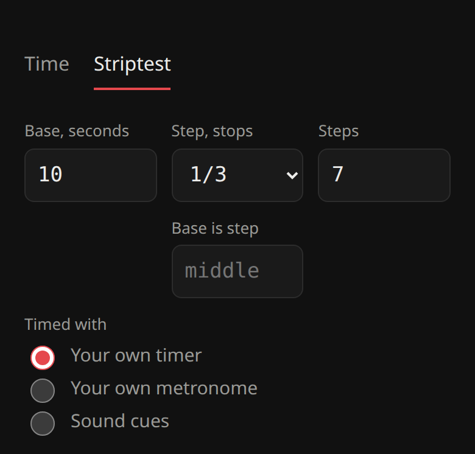 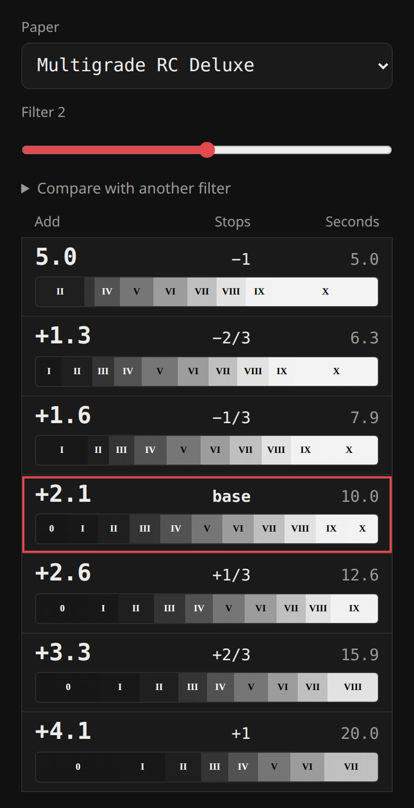</p>

Until we say otherwise, the website takes the teststrip to be **Timed with** a timer. The table has one row for each patch. **Seconds** is the exposure the patch should end up with, and **Add** is how to get there when the patches are covered one by one: the whole strip first gets 5.0 seconds, then we cover the first patch and give the rest 1.3 seconds more, cover the next one and give the rest another 1.6, and so on. If we would rather expose every patch on its own, each simply gets what it says under **Seconds**. The times are rounded to tenths of a second, which is about what a timer can be set to.

### Without a timer
With a timer that is all there is to it. Without one these times are hopeless, since nobody can count to 1.3 seconds, and something has to keep time for us. There are two answers under **Timed with**: a metronome, which is what the rest of this walkthrough uses, or the page's own sound, which is further down under **At the enlarger**. The line under the settings has already been hinting at the first. We choose **a metronome**, which the website remembers until we choose something else:

<p align="center">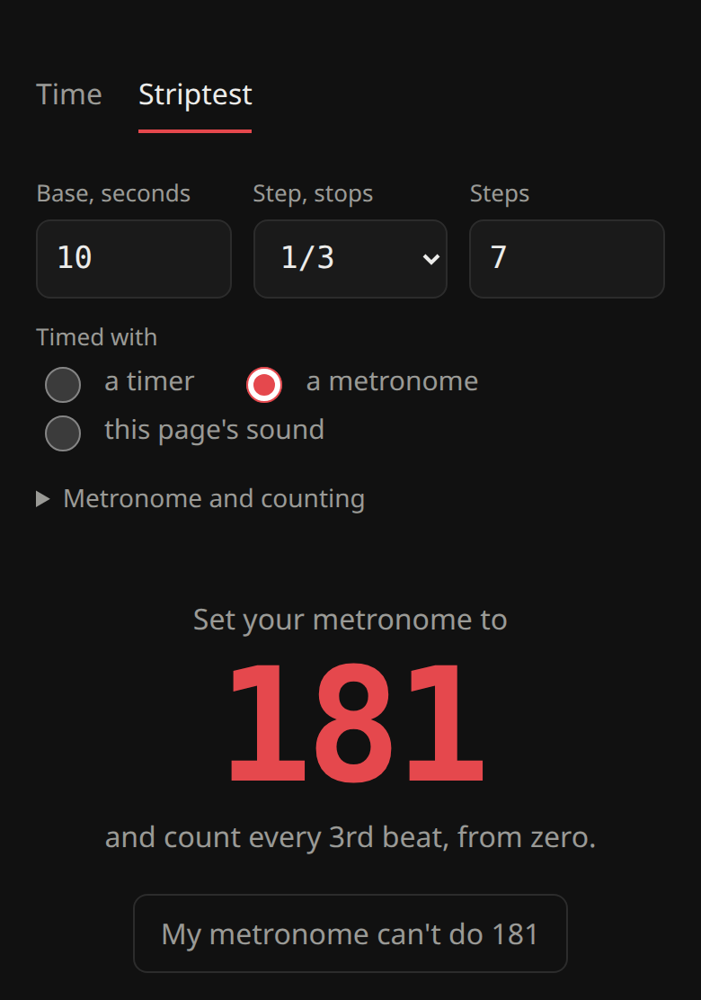 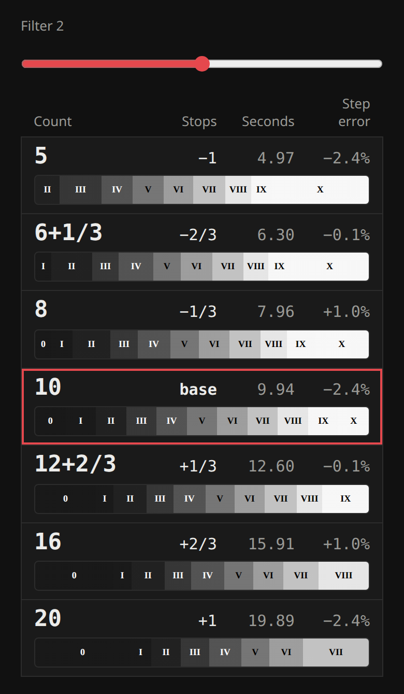</p>

The big red number tells us to set the metronome to 181, and the line under it to count every 3rd beat. The table is read exactly like the output of the Python script. We start the exposure on the count of zero, cover the first patch on the count of 5, the next one on 6+1/3, then on 8, 10 and so on. **Seconds** is the time each patch really gets, and **Step error** is how far that is from the ideal time, as a percentage of the stepsize. Here no patch is more than 2.4% of a third of a stop off, which is quite a bit better than what counting half seconds gave us in the **Background** section.

### But my metronome can't do 181
Most likely it can't. Many metronomes have gaps between their tempos, especially the fast ones. With the Python script this is what the tempo file is for. On the website we just press **My metronome can't do 181**, and get the next best tempo instead:

<p align="center">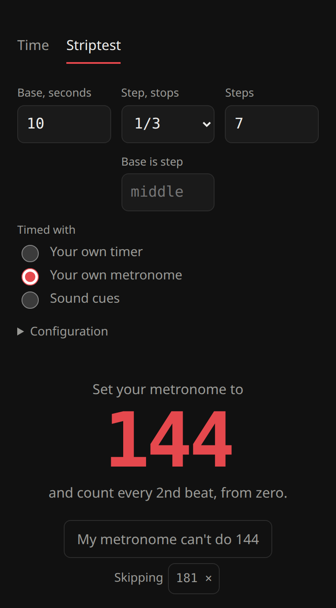</p>

144 is a tempo that even my old mechanical metronome has, so we go with that, and count every 2nd beat. The price is a slightly worse teststrip, where the worst patch is now 3.4% of a step off. If 144 had been missing as well, we would just press again, until we land on a tempo the metronome can do.

The tempos we have skipped are remembered on the device, so after a few printing sessions the website knows the metronome, and stops suggesting tempos it doesn't have. If one was skipped by mistake, pressing it in the **Skipping** list brings it back, and to start over entirely there is a **Forget all skipped tempos** button under **Metronome and counting**.

### How big should the steps be?
Before any paper is exposed, the little strips under each row are worth a look, whichever way the teststrip is timed. They are a rough simulation of what the patches are going to look like, expressed in the zones of the Zone System: 0 is full black, V is middle grey and X is paper white.

The strips are read up and down. A place along the strips is one part of the picture. The row with the box around it is the **reference**, the exposure we are hoping is the right one, and its strip is simply the scale from Zone 0 to Zone X. Now we pick a tone in the reference row, say a highlight in Zone VIII, and look straight up and down. The zone we find at that same place in another row is what that highlight prints as in that patch. In the table above, the Zone VIII highlight has become a VII one patch darker than the base, and a VI a full stop darker. Going the other way it is a IX one patch lighter, and after that it is gone: paper white.

How much happens from one patch to the next depends on the paper, which is chosen under **Paper**, and a lot on the filter, which is set with the **Filter** slider right below it. Here is the same teststrip at filter 00, 2 and 5:

<p align="center">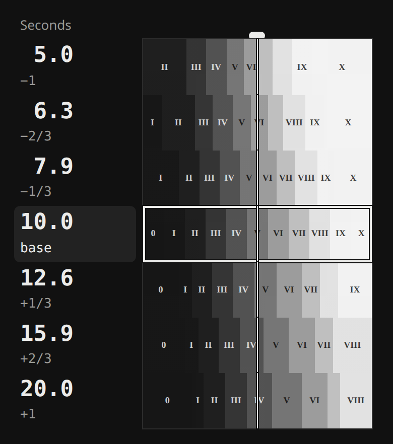  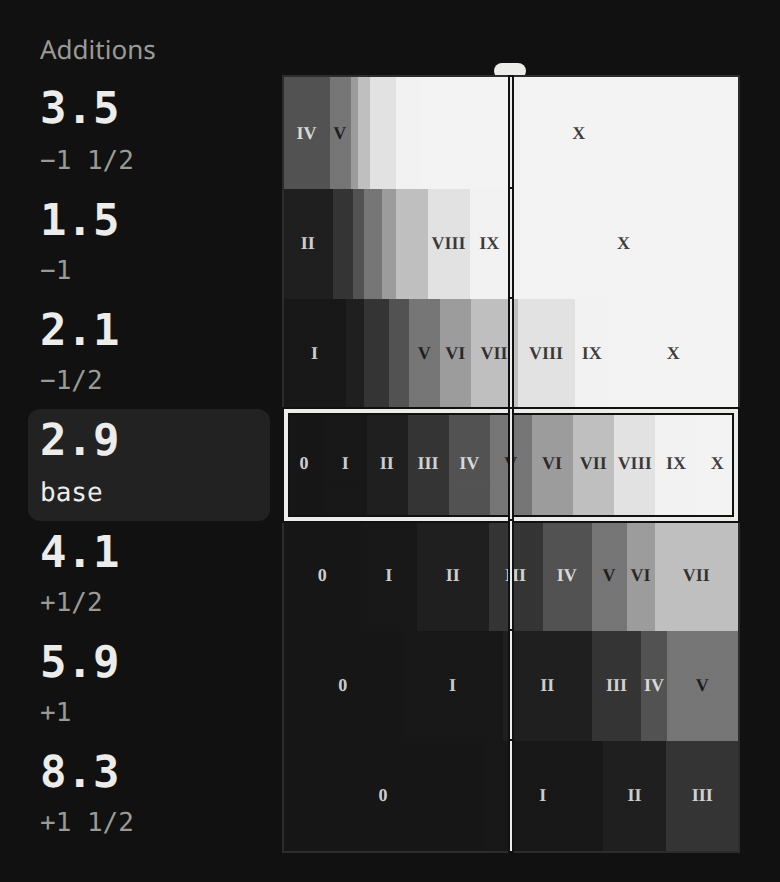</p>

At filter 00 it takes most of a stop to move a tone by one zone, so patches a third of a stop apart are hard to tell from each other, and I would go for bigger steps. At filter 5 a third of a stop is more than a zone and a half, neighbouring patches look nothing alike, and finer steps are needed if we want to land anywhere near the right exposure.

How seriously should these strips be taken? Not very. The tones come from the characteristic curves in Ilford's data sheet for the chosen paper, which is either the current Multigrade RC Deluxe or the Multigrade IV RC Deluxe it replaced, developed the way Ilford developed it. Only Zone V is a fixed tone (18% grey). Zone 0 and Zone X are simply the blackest and the whitest the paper gets, and the zones in between are placed where a normally developed negative would put them at filter 2 on Multigrade IV. They are the same tones on both papers. Your paper, your developer and above all your negative are different. The strips are there to build intuition, and they do not replace the actual teststrip. They do however use the exposures we actually get, including the small errors in the table. With a timer that is the rounding to tenths of a second.

### Reading the teststrip
The teststrip is developed and dry, and the patch at +2/3 looks about right, but we would like to know what happens to the highlights if we go a little either way. We tap that row, and it becomes the reference (on the left below). Everything is now reckoned from the patch we believe in.

The zones are handy for this, but they are also coarse, and a lot can happen inside a single zone. So for the nuances, we slide a finger sideways along the row, or drag with the mouse (on the right below). The strips then stop showing the whole scale, and every strip instead shows one single tone in full: the tone that the part of the picture under the finger gets in that patch, along with the zone it is nearest to.

<p align="center">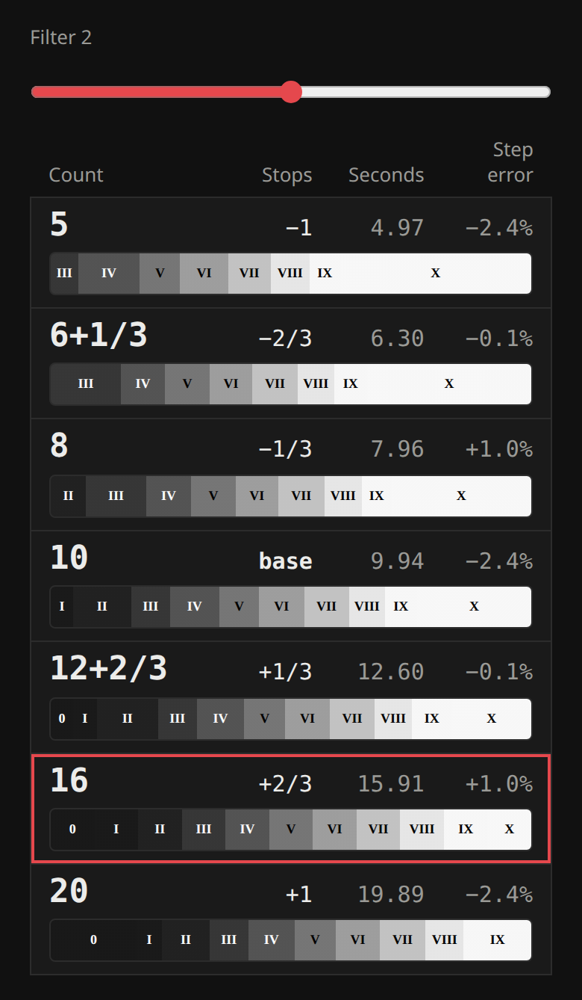 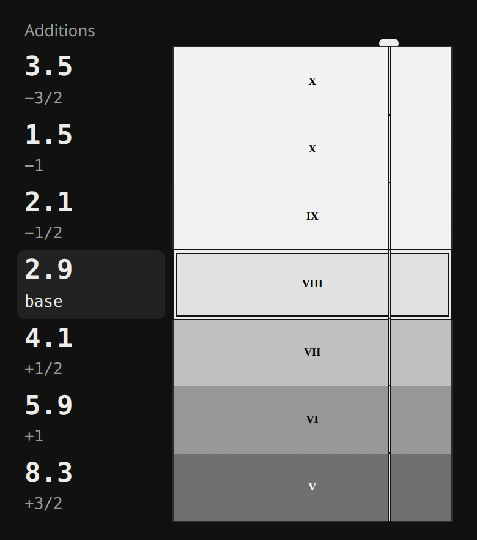</p>

Here the finger is on a Zone VIII highlight in our chosen patch. One patch darker it would be a VII, one patch lighter a IX, and in the rest of the teststrip it is blown out. The row we slide on is the reference for as long as we like, until another row is tapped.

### Would another filter be better?
The highlights look right at 16 seconds, but let's say the shadows do not. The darkest part of the picture that should still show some detail, which we would like to see in Zone II, has only made it to a III. More exposure would darken it, but as we just saw, that drags the highlights down with it. This is a job for a harder filter, and we can try one on the website before we expose for it. Under the filter slider we open **Compare with another filter**, and set the other filter to 3 (on the left below):

<p align="center">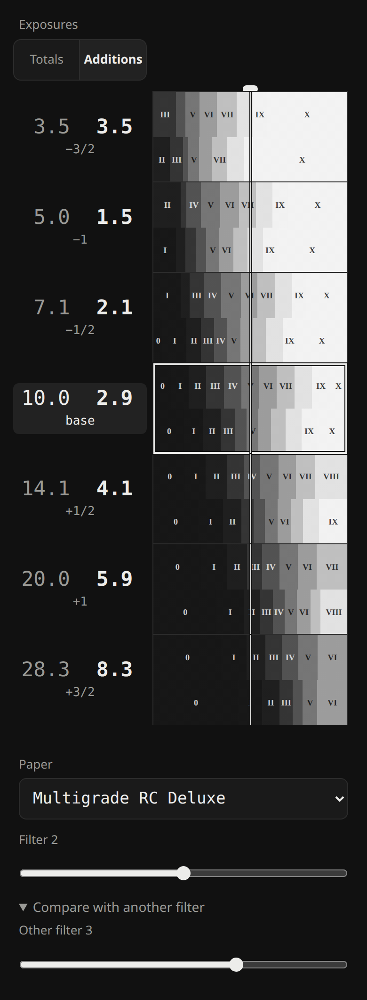 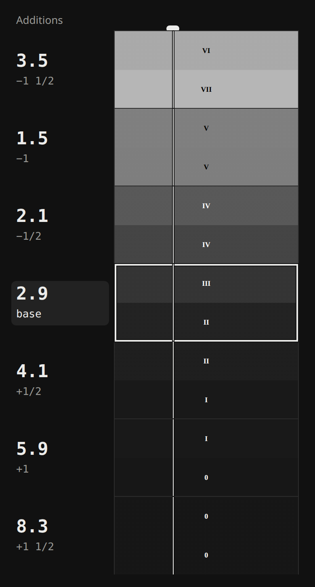</p>

Every row has now got a second strip under its first. It is the same patch, exposed for the same number of seconds, but through filter 3 instead of filter 2. The strips are read exactly as before, and a place along them is still one part of the picture. So we find our shadow in the upper strip of the reference row, and look at the strip right under it. Sliding a finger along the row works here too (on the right above): the shadow that is a III at filter 2 becomes a II at filter 3, which is what we wanted.

And the highlights? The same exercise on the Zone VIII highlight shows that filter 3 lifts it to a IX at 16 seconds, and that it is an VIII again at 20 seconds. So filter 3 it is, and the right exposure is probably a third of a stop or so above 16 seconds.

The two filters are lined up by the paper speeds in Ilford's data sheet. Multigrade filters are speed matched: 00 to 3 need the same exposure, and 4 and 5 need more. On Multigrade IV that is a whole stop, and on the current Multigrade RC Deluxe only about an eighth of a stop, if the data sheet is to be believed. What two filters of the same speed have in common is a tone just a bit lighter than middle grey, and from there a harder filter pushes everything lighter further up, and everything darker further down. With other filters, a colour head, or filters that have faded over the years this is going to be off, so the same goes as before: the strips are there to build intuition.

### The second teststrip
So we go up to filter 3, and expect the right exposure to be somewhat above 16 seconds. We want a finer teststrip that starts just above 16 seconds: 5 patches in 1/6 stop steps. We type 16 into **Base, seconds**, choose 1/6 and 5 steps, and open **Metronome and counting**. There we set **Base is step** to 0, which places the base one step *before* the first patch, like `-p -1` does in the script (leave it empty and the base lands in the middle, and 1 puts it on the first patch). With a timer the same field is found under **Placing the base**. Since we want to stop the exposure between each patch this time, we also tick **Count each step from zero, adding to the one before**, and set **Count every** to beat, which makes that kind of counting easier:

<p align="center">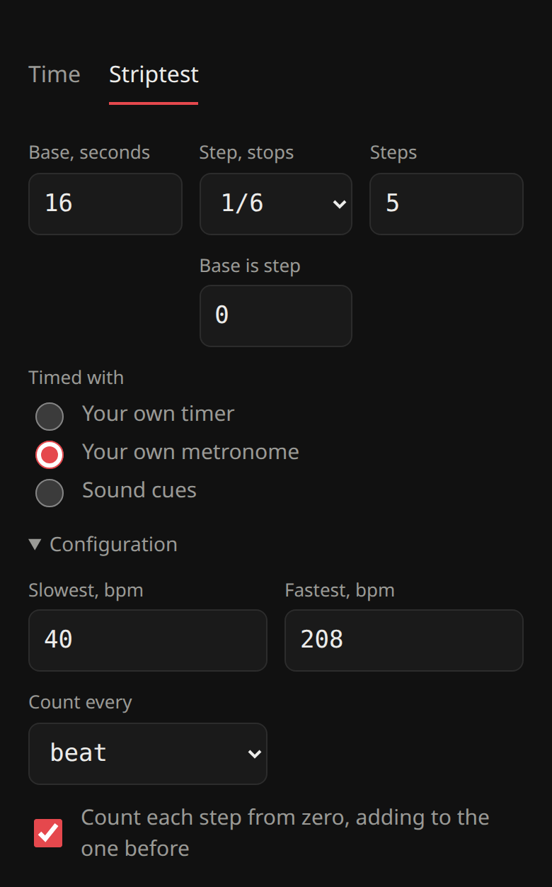 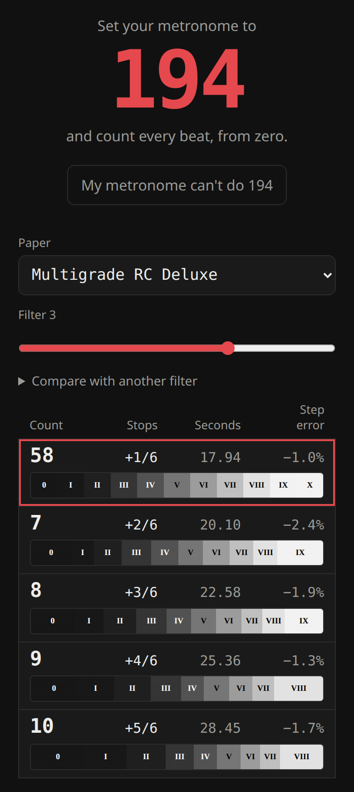</p>

We set the metronome to 194 and count every beat. The whole strip first gets 58 beats. Then we cover the first patch and give the rest 7 more beats, starting from zero again, then 8, 9 and 10. This is exactly what `python striptest.py -b 16 -n 5 -s 6 -p -1 -c -d 1` tells us to do.

If the metronome has another range than 40 to 208 bpm, this is also the place to say so, under **Slowest, bpm** and **Fastest, bpm**.

### At the enlarger
Everything so far happens with the lights on. When they go out, the phone is the wrong shape entirely: a white page is a fog risk, the browser's bars are in the way, and the screen turns itself off halfway through a strip. The button under the table, **Darkroom view**, deals with all three. It fills the screen with the plan in large red type on black, asks the phone to stay awake, and shows nothing that can be tapped by mistake. Close, or Escape, brings the page back.

Red only is safer than white, but it is not safe, and the website says so too. The screen is still a light source, and Multigrade paper is most sensitive to exactly the green and blue that a red-only screen leaves out — which is the point, but a bright phone held over the paper will still fog it. Turn the brightness right down, keep the phone away from the easel, and test your own phone before trusting it: leave a scrap of paper face up beside it for five minutes and develop that. It is also worth turning on airplane mode or Do Not Disturb first, because a notification lights the whole screen at full brightness, and that is a fogged sheet.

The third choice under **Timed with**, **this page's sound**, is for when there is neither a timer nor a metronome to hand. The table then simply gives the seconds each patch ends up with, and the darkroom view offers a Start button. Pressing it gives a count-in — four seconds unless you set it otherwise under **Count-in and placing the base**, and it is remembered. Under the count-in a drone sounds an octave below the one that follows it, so the two can never be confused, and on the lamp it simply steps up and holds for as long as the exposure runs. Over it a second tone climbs, and lands an octave higher exactly on each moment you have to act on, where a short accent falls: one for each patch to cover, and the last is the lamp off. Then silence, which is how you know it is over. Because the pitch is always climbing towards the next one, a mark never arrives unannounced, and it arrives just as decisively whether the gap was one second or ten.

Inside the darkroom view, sound mode shows the same plan as the other two: the patch numbers and the seconds each patch ends at. Beside each of them is a bar as long as the wait for that patch, with one more above them all for the count-in. They are drawn to one scale, so before anything is started the plan is already a picture of how long the strip takes — the long bar near the top is the base exposure, and the rest grow by a step each. Nothing about them moves. While a run goes, the line it is waiting on is lit and the others go dim, so a glance says where it has got to, and the screen gives as little light as it can while saying it.

Sound mode offers two ways to start: **Start**, which keeps the red type and the bars up while the run goes, and **Start dark**, which gives the screen up altogether. A screen is only a light source, and by ear you need not look at all. A black screen stays black after the run has finished as well, which is deliberate — a strip ending is the worst possible moment to light the room, with the paper still out. The whole of that black screen is then the one control, and it knows two things: a tap starts a run and stops one that is going, so a strip can be halted and begun again without ever seeing the screen, and a hold of about three quarters of a second gives the screen back and ends the run with it. It reddens very faintly while you hold, so you can tell the hold has taken. Started the lit way instead, a run can only be stopped by holding the button, so that a hand feeling around in the dark cannot quietly end an exposure. If the phone rings, or anything else takes the page away mid-run, the sound stops and the view says so: that strip is spoiled, and better to know it.

One last thing worth doing before a printing session: add the page to the home screen, from Share → Add to Home Screen on an iPhone, or the browser menu on Android. It then opens without the browser's bars, which on an iPhone is the only way to be rid of them, and it works with no network at all once it has been opened online once.

## The Python script

### Basic Example
As shown in the **quickstart** section, the script can be run without any arguments.

However, to find the optimal tempo for a 6-second base exposure over 5 steps, we use the -b (base) and -n (numsteps) arguments:
```bash
$ python striptest.py -b 6 -n 5
TEMPO 190
Count every 3rd beat

     Count      Stops    Seconds   Target Sec   % of stepsize Error
     4           -2/3      3.789        3.780       1.1%
     5           -1/3      4.737        4.762      -2.3%
     6+1/3          0      6.000        6.000       0.0%
     8           +1/3      7.579        7.560       1.1%
    10           +2/3      9.474        9.524      -2.3%
```
As seen, the script finds an optimal tempo (e.g., 190 bpm) to minimize exposure inaccuracies, with much smaller errors compared to the above example counting half seconds.

In this case, set your metronome to 190 bpm, optionally make the metronome accent every third beat, and simply start exposing by counting the accented beats. The metronome will in this case be effectively beating triplets, so a count of 6+1/3 illustrates you should stop on the first triplet after the 6th accented beat.

As always in darkroom printing, you should start your exposure at the count of zero.

### Usage

To use the script, you can adjust several parameters to control how the tempo is calculated. Below are the options available:

- `-b`, `--base`: Base exposure time in seconds (float). Default is `10`.
- `-s`, `--stepsize`: Inverse of the stepsize as an integer (int). `1` is one stop, `2` is 1/2 stop, etc. Default is `3`.
- `-n`, `--numsteps`: Number of steps (int) for the strip test. Default is `7`.
- `-p`, `--baseplace`: Amount of steps away from the first value, for the base value to be placed. -p 0 sets the base at the first step. -p -1 sets it 1 step before the output list. By default, base is placed in the middle for uneven n, and just before middle for even n. 
- `-tmin`, `--tmin`: Minimum tempo (int) in bpm to consider. Default is `40`.
- `-tmax`, `--tmax`: Maximum tempo (int) in bpm to consider. Default is `208`.
- `-f`, `--file`: Optional input file with specific tempo options (plaintext file).
  Each line can either be:
    - A single BPM number (e.g., `60`).
    - A range of BPMs using the shorthand format `start:end [step]` (e.g., `40:60 [2]` for a range from 40 to 60 in steps of 2).
      Multiple ranges can be listed on separate lines. 
  If a file is provided, it overrides `-tmax` and `-tmin`.
- `-c`, `--cumulative`: Use cumulative timing for the test strip such that each step builds upon the previous. Useful for those who prefer to start counting from 0 on each step. Default is local timing where each step shows the time for its full exposure.
- `-d`, `--divisions`: Force a specific subdivision pattern for beats. Accepts an integer that sets the divisor (e.g., `2` for halves, `3` for triplets). Overrides the automatic subdivision based on tempo.
- `--plot`: If specified, plot the achieved stops vs the theoretical stops in the end. Provides a visual reference for the accuracy. 

#### More examples

To run a strip test with a base exposure of 6 seconds, 5 steps, and default options:
```bash
python striptest.py -b 6 -n 5
```

To specify a different stepsize (e.g., 1/2 stop increments):
```bash
python striptest.py -s 2
```

To use a custom tempo range between 60 and 180 bpm, and specify that we want to count every beat:
```bash
python striptest.py -tmin 60 -tmax 180 -d 1
```

To use a custom file with tempo options:
```bash
python striptest.py -b 6 -n 5 -f tempos.txt
```

Custom tempo files are useful for metronomes with skips in their possible bpm options. Some metronomes, for instance, only include every other bpm above a certain value, and even every third bpm above a higher value. Tempo files should contain tempo values in either of the following formats:

- **Single BPMs**: Each line should contain a single integer value representing a BPM.
  If you only want to use tempos 60, 120, and 180, the file contents should look like:
  ```
  60
  120
  180
  ```

- **Shorthand Ranges**: You can also specify ranges of tempos using the shorthand format:
  ```
  start:end [step]
  ```
  where `start` is the starting BPM, `end` is the ending BPM, and `step` is the interval. This makes it easy to specify a large range of tempos concisely.

  **Example**: 
  ```
  # This is a very common set of BPMs, used in many metronomes
  40:60 [2]
  60:72 [3]
  72:120 [4]
  120:144 [6]
  144:208 [8]
  ```

Multiple ranges and single BPMs can be mixed within the same file. Each tempo or range should be on its own line. If a tempo file is provided, it will override the `-tmax` and `-tmin` options specified on the command line.


#### Extended example
Let's say our metronome has a range from 30-200 bpm, and that we previously obtained a good exposure at 8 seconds, but the contrast needed modification such that we know that the 8-second exposure will be underexposed by at least 1/6 stop at the new contrast setting. We can do the following:
We make a 5-step teststrip (`-n 5`) where we place the base of 8 seconds before the first step (`-b 8 -p -1`), and do increments of 1/6 stops from there (`-s 6`). Furthermore, we are doing a cumulative teststrip, so each step builds upon the next (`-c`). For cumulative counting, it is often easier to set the divisions to 1, so we count every beat (`-d 1`), and in the end, we want to plot the stopwise error from the theoretical targets (`--plot`). This will result in the following output:
```
$ python striptest.py -n 5 -b 8 -p -1 -s 6 -tmin 30 -tmax 200 -c -d 1 --plot

TEMPO 160
Count every beat

     Count      Stops    Seconds   Target Sec   % of stepsize Error
    24           +1/6      9.000        8.980       2.0%
     3           +2/6     10.125       10.079       3.9%
     3           +3/6     11.250       11.314      -4.9%
     4           +4/6     12.750       12.699       3.5%
     4           +5/6     14.250       14.254      -0.3%
```
While -4.9% error might seem like a lot, remember it is percentages of the stepsize, so it is not so bad. The output plot shows this:
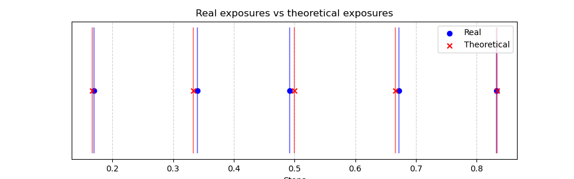
### Installing and running

1. Clone the repository:
   ```bash
   git clone https://github.com/BinFlush/striptest.git
   ```

2. Navigate to the project directory:
    ```bash
    cd striptest
    ```

3. Install dependencies:
   ```bash
   pip install -r requirements.txt
   ```

4. Run the script:
    ```bash
    python striptest.py
    ```

## Contributing
Contributions are welcome! Please open an issue or submit a pull request.

There is a test suite, which is run with `just test` (it needs python with numpy, node and [just](https://github.com/casey/just)). It checks that the Python script still reproduces the examples in this README, and that the website agrees with the Python script on a few thousand random settings.

# FAQ
* **How am I supposed to use the computer in a darkroom?**

Most people take some sort of notes when working in the darkroom. Many use an analog notebook, some use an ipad. Whatever your notetaking equipment may be, the data from this script can be easily transferred to the notes by hand. The intended use is, for this only to be used on a laptop in lights-on scenarios, while planning your next step. When lights go out, the laptop should hibernate, or at least by some means expel no light. As long as the data is transferred to your processing notes.

If the "Count" numbers are difficult to memorize, they may be written on a scrap piece of paper, which can be referred to during exposure.

With the website, the laptop can be swapped for a phone, which makes the planning part a lot less clumsy. The rest still applies though: a phone screen is a very effective way of fogging paper, so it goes face down or out of the room before the paper comes out.

* **Why not build an Arduino based f-stop timer since it's cheap?**

An Arduino based f-stop timer is still not cheaper than a metronome, and the metronome is wonderfully flexible and simple. It can be seen as an example of the KISS design principle (Keep It Simple Stupid), where a basic wristwatch in principle could replace the metronome. This script then functions as a bridge between the metronomes full timing capabilities, and our f-stop printing.

Also, not everyone likes to solder, but everyone loves metronomes. 

* **Why doesn't this script just include a metronome?**

If the python script was responsible for timing during exposure, that would be a whole other piece of software. You could imagine a timer that simply beeps at the appropriate stops (with some count-in before each beep), but that would completely negate the necessity for a metronome, be-it hardware or software. Instead, you would simply end up with an ordinary software f-stop timer, which is a much simpler task than the optimization task this **striptest.py** solves. 

Software of this sorts would also need some way to reliably turn off any lights (screen, backlight keyboard, power switch, etc...) during exposure, which is a nontrivial task. Arduino-kits or commercial f-stop timers are better suited for this.

The website has since gone at it from the other side. It can time a run itself, by sound, but that is not a metronome: there is no click track, no tempo, and nothing to count. It just sounds the moments you have to act on, and the pitch climbing into each one is what makes them easy to hit. It is a different answer to the same problem, for when there is neither a timer nor a metronome to hand.

The tempo search is still what this whole thing is about, and it is still the only way to get an arbitrary interval out of a real metronome, which remains my own way of working. And if what you want is a proper f-stop timer, something like [GoTimer's enlarger timer](https://gotimer.org/photography/enlarger-timer) is still a better fit than either.

* **Is this precision necessary**

In short - not really. I have always done f-stop printing with the method as described in the **Background** section above, simply counting naively rounded half seconds. This is accurate enough as long as you keep the exposures long enough, typically above 10 or 12 seconds..

This software is mostly for those who get satisfaction from using the simple tools at hand in an optimal manner. It is fun to get precise arbitrary exposure intervals from a simple metronome. I don't expect many people to use it, but I definitely do.


# Not-so-FAQ
* **How does the math work?**

That is a great question. I'm glad you asked!

We are looking for the optimal bpm tempo $t \in T \subset \mathbb{N}$ for which there exist beat numbers $\mathbf{M}^\ast \subset \mathbb{N}^n$ such that these beats best match a set of target exposure stops $\mathbf{a}=[a_k]_{k=1}^n$ which is a vector of required stopwise deviances from a basetime $b$. 

For a given stop $a_k$, and a base $b$, we have the required time (in seconds) for that exposure:

```math
s = b \cdot 2^{a_k}
```
Since a given beat placement is just a function of the beat number and the tempo: 
```math
s = m \cdot \frac{60}{t}
```
we have:
```math
m \cdot \frac{60}{t} = b \cdot 2^{a_k} \implies m \cdot \frac{60}{t \cdot b} = 2^{a_k} \implies \log_2(m) + \log_2\left(\frac{60}{t \cdot b}\right) = a_k
```

However, since we need integer values of $m$, what we actually want is to minimize the expression:
```math
 \mathcal{L}_t = \sum_{k=1}^n \epsilon_k = \sum_{k=1}^n \left(\log_2(m^\ast_k) + \log_2\left(\frac{60}{t \cdot b}\right) - a_k\right)^2,  \quad m^\ast \in \mathbb{N}
```

Let $u$ be a function of the tempo $t$:
```math
u(t) = \log_2\left(\frac{60}{t \cdot b}\right)
```
Then, we can rewrite $\mathcal{L}_t$ as:
```math
\mathcal{L}_t = \sum_{k=1}^n \epsilon_k = \sum_{k=1}^n \left(\log_2(m^\ast_k) + u(t) - a_k\right)^2, \quad m^\ast \in \mathbb{N}
```

If we look at a single $k$, set $\epsilon_k$ to zero, and we have:
```math
\epsilon_k = \left(\log_2(m^\ast_k) + u(t) - a_k\right)^2
```
but we can insert $m$ into this and get:
```math
\left(\log_2(m_k) + u(t) - a_k\right)^2 = 0 \implies \log_2(m_k) = a_k - u(t) \implies m_k = 2^{a_k - u(t)}
```

This is great. We now have $m_k$, but remember it is in $\mathbb{R}$, and we cannot simply round it, since this operation would be done in linear space. We have to find the closest $m_k^\ast$ in log-space.

### Finding the Closest Integer in Log-Space

To do this we need to find the integers that minimize the error in the logarithmic domain. Since $m_k = 2^{a_k - u}$ is a real number, we denote its closest integers as $m_k^{\text{low}}=\lfloor m_k \rfloor$ and $m_k^{\text{high}} = \lceil m_k \rceil$.

We now need to choose between these two candidates based on which one minimizes the error in log-space:
```math
\epsilon_k = \left(\log_2(m_k^\ast) + u - a_k\right)^2
```

We compute the errors for both rounding options:
- For $m_k^{\text{low}}$, the error is:
```math
  \epsilon_k^{\text{low}} = \left(\log_2(m_k^{\text{low}}) + u - a_k\right)^2
```
- For $m_k^{\text{high}}$, the error is:
```math 
  \epsilon_k^{\text{high}} = \left(\log_2(m_k^{\text{high}}) + u - a_k\right)^2
```

We then select $\hat{m}_k^\ast$ as the value that minimizes the error:
```math
\hat{m}_k^\ast = 
\begin{cases} 
m_k^{\text{low}} & \text{if } \epsilon_k^{\text{low}} \leq \epsilon_k^{\text{high}} \\
m_k^{\text{high}} & \text{otherwise}
\end{cases}
```

### Calculating the Total Error
Once we find the optimal $\hat{m}_k^\ast$ for each $k$ given a tempo $t$, we can calculate the total error:
```math
\mathcal{L}_t=\sum_{k=1}^n\epsilon_k = \left(\log_2(\hat{m}_k^\ast) + u(t) - a_k\right)^2
```


### Optimizing Over Tempi
To find the optimal tempo $t$, we iterate over all possible tempi $t \in T$, and for each tempo, compute the corresponding $\hat{m}_k^\ast$ values and evaluate the total error $\mathcal{L}_t$. The optimal tempo $t^\ast$ is the one that yields the smallest error:
```math
t^\ast = \arg\min_{t \in T} \mathcal{L}_t
```

### Further optimizations
Any given tempo $t$, has beats $B = \\{1\cdot \frac{60}{t},2\cdot \frac{60}{t},...\\}$.
If we then consider another tempo $t^{\prime}=t/n, \quad n \in \mathbb{N}$ with beats 
```math
B^\prime= \left\{1\cdot \frac{60}{t^\prime},2\cdot \frac{60}{t^\prime},...\right\} = \left\{1n\cdot \frac{60}{t},2n\cdot \frac{60}{t},...\right\}
```
We can immediately see that $B^\prime \subset B$.
When evaluating through the set of tempi, we therefore start from the maximum bpm and work downwards. Whenever we encounter a tempo that is guaranteed not to be the optimal (because its loss $\mathcal{L}_t$ is not the lowest so far), we thus know that all other tempi $t^\prime$ that divide $t$ also cannot have an optimal solution. We therefore skip evaluating these tempi further down the line. We do this by simply finding all divisors of $t$ and adding them to an "exclude" set.


