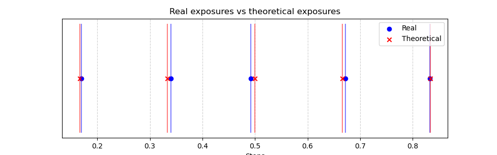

# striptest
A tool for planning f/stop test strips in the darkroom, and for timing them: by sound cues the page makes itself, or with a physical metronome at the best tempo for the strip. The seconds are there too, for anyone with a timer.

**Use it here: https://striptest.lutzen.co/**

## How to use
- Type in the exposure you think the print needs (in seconds), the stepsize between patches (in stops), and how many patches you want. You then see a table with a row for each patch in the test strip.
- The row marked "base" is the exposure time you typed in at the top. It can be moved by tapping any other row.
- The switch over the figures (Totals or Additions) sets whether the counter in darkroom mode counts additively (for when you cover the test strip as you go) or such that each patch gets its full exposure time (for when each patch is exposed separately).
- The table of densities is for comparing exposures and filter grades using the zones of the Zone System, 0 full black, V middle grey and X paper white. To compare exposure times or filter grades (when using the "Compare with another filter" option), find a reference density on a row and look up or down to another row, to see what this density would become with that exposure or filter grade. You can also drag horizontally for a focused density comparison.
- The page can keep the time by sound: "Run in Darkroom Mode" at the foot of the screen. Or tick "Use a metronome instead" and it gives a tempo and counts.
- "Start dark" turns the screen black. Tap it to start or stop a run. Hold it to get the screen back.
- Whether or not Darkroom Mode is darkroom safe depends on your device and paper. Turn the brightness down, keep the phone away from the paper, and preferably test on a scrap of paper.
- On an LCD screen (iPhone SE, XR and 11, most cheaper Android phones) black still glows. Lock the phone instead. Darkroom Mode still plays the audio cues, and the lock screen's play and pause, or an earbud button, start and stop it.
- Use airplane mode or Do Not Disturb to prevent a notification from lighting the whole screen.
- Opened once online, the page works with no network. Added to the home screen, from Share on an iPhone or the browser menu on Android, it opens without the browser's bars.

## The Python script
This started as a Python script, written for my own use and run on a laptop while planning a printing session. It is still here, and it is still the reference: the website is tested against it on thousands of random settings, so the two always agree on the tempo and the counts. It finds the tempo and the counts for a metronome, and nothing else.

Ensure you have python and numpy installed, download `striptest.py`, and run it:
```
python striptest.py
```
By default it plans 7 patches in 1/2 stop steps around a base of 10 seconds, for which the best tempo happens to be 204 bpm:
```
TEMPO 204
Count every 3rd beat

     Count      Stops    Seconds   Target Sec   % of stepsize Error
     4           -3/2      3.529        3.536      -0.5%
     5+2/3         -1      5.000        5.000       0.0%
     8           -1/2      7.059        7.071      -0.5%
    11+1/3          0     10.000       10.000       0.0%
    16           +1/2     14.118       14.142      -0.5%
    22+2/3         +1     20.000       20.000       0.0%
    32           +3/2     28.235       28.284      -0.5%
```
Set the metronome to 204, let it accent every third beat if it can, and start counting from zero as the exposure starts: the whole strip gets 4 counts (12 beats), then the first patch is covered and the rest get up to 5+2/3, and so on. The script keeps one count running unless `-c` is given, which starts the count again at every patch, as the page's additions column does.

### Usage
- `-b`, `--base`: Base exposure time in seconds (float). Default is `10`.
- `-s`, `--stepsize`: Inverse of the step size as an integer (int). `1` is one stop, `2` is 1/2 stop, etc. Default is `2`.
- `-n`, `--numsteps`: Number of steps (int). Default is `7`.
- `-p`, `--baseplace`: Where the base is placed, in steps from the first patch. `-p 0` puts the base on the first patch, `-p -1` one step before the strip. By default the base is placed in the middle for an uneven number of steps, and just before the middle for an even one.
- `-tmin`, `--tmin`: Slowest tempo (int) in bpm to consider. Default is `40`.
- `-tmax`, `--tmax`: Fastest tempo (int) in bpm to consider. Default is `208`.
- `-f`, `--file`: A file of the tempos the metronome has, one per line, either a single bpm (`60`) or a range as `start:end [step]` (`40:60 [2]`). Lines starting with `#` are comments. A file overrides `-tmin` and `-tmax`. Metronomes with gaps between their tempos are what this is for; a common scale is `40:60 [2]`, `60:72 [3]`, `72:120 [4]`, `120:144 [6]`, `144:208 [8]`.
- `-c`, `--cumulative`: Count each patch from zero, so that every count is what the patch adds to the one before. By default each count is the patch's total.
- `-d`, `--divisions`: Count every so many beats (`1` for every beat, `3` for every third). By default this is chosen from the tempo.
- `--plot`: Plot the achieved stops against the target stops at the end.

For a 6-second base over 5 patches in thirds, `python striptest.py -b 6 -n 5 -s 3` finds 190 bpm, counting every 3rd beat: 4, 5, 6+1/3, 8 and 10. And a strip of 5 patches in 1/6 stop steps from an 8-second base placed one step before it, counted from zero on every beat on a metronome that runs from 30 to 200 — `python striptest.py -n 5 -b 8 -p -1 -s 6 -tmin 30 -tmax 200 -c -d 1 --plot` — comes to 160 bpm: 24 beats, then 3, 3, 4 and 4 more, none of them more than 4.9% of a step off, which the plot shows:



To run the tests as well, clone the repository and `pip install -r requirements.txt`.

## Contributing
Contributions are welcome. Please open an issue or submit a pull request.

